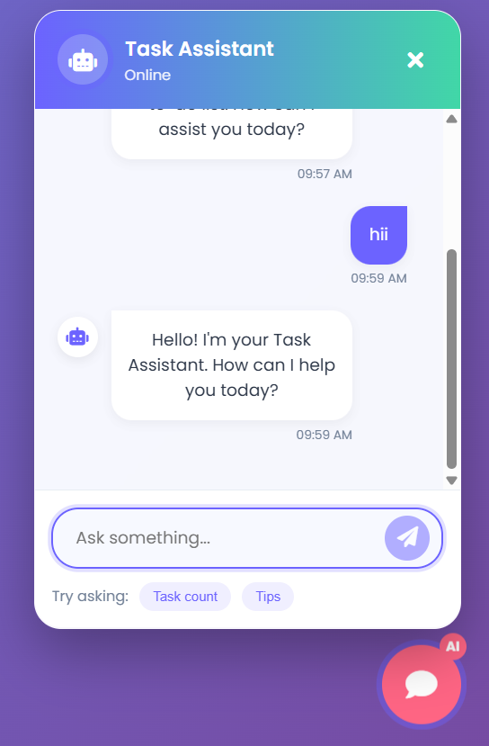

# 🧠 Simple AI-Enhanced Task Manager

A clean full-stack app combining a To-do Manager, Feedback Tracker, and an AI Chat Assistant powered by **Groq's model**.
---

## ✨ Features

* ✅ **To-do Manager**: Add and track your daily tasks.
* 💬 **Feedback Tracker**: Collect and view feedback entries.
* 🤖 **AI Chat Assistant**: Ask questions or get help using LLM-powered responses via Groq API.
* 🌐 Built with **Next.js** (frontend) + **Express.js** (backend).

---

## 🛠️ Tech Stack

* **Frontend**: Next.js (React)
* **Backend**: Node.js + Express
* **LLM Provider**: Groq (`llama3-70b-8192`)
* **API Communication**: Axios

---

## 🚀 Getting Started

### 1. Clone the repo

```bash
git clone https://github.com/ashwin1099/ai-todolist.git
cd ai-todo-feedback
```

### 2. Install frontend dependencies

```bash
cd frontend
npm install
```

### 3. Install backend dependencies

```bash
cd ../backend
npm install
```

### 4. Set up your environment variables

In `backend/.env`, add your Groq API key:

```env
GROQ_API_KEY=your_groq_api_key
```

### 5. Start both servers

**In one terminal:**

```bash
cd backend
node index.js
```

**In another terminal:**

```bash
cd frontend
npm run dev
```

App will be available at `http://localhost:3000`

---

## 🧠 AI Integration Details

The chatbot uses the [Groq API](https://console.groq.com/docs) with the model:

```
model: llama3-70b-8192
```

Backend sends user messages to Groq and streams back the assistant’s response.

---

## 📂 Project Structure

```
/frontend         # Next.js frontend
  /pages
    index.js      # Main UI
  /public
  /styles
/backend          # Express.js backend
  index.js        # Chat route with Groq integration
  .env            # API key for Groq
```
---
## 📸 UI Screenshots

Below are some previews of the application interfaces:

### ✅ Task Manager Panel 
A clean dashboard layout to manage tasks.


---

### 🤖 AI Chat Assistant 
A conversational AI assistant interface optimized for mobile screens.



---


## 📌 Notes

* This project is free, local-first, and no user data is stored permanently.
* All AI chat is routed securely via your own API key to Groq.
* Only chatbot requires internet; rest of the app works offline.

---

## 📃 License

MIT

---

